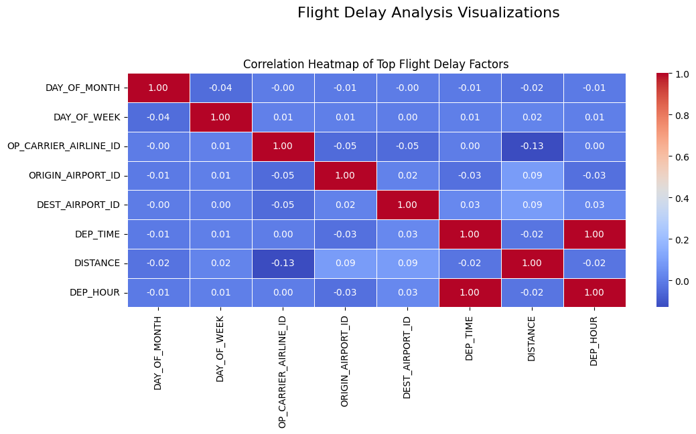

# Flight Delay Prediction Analysis

## Mission
This project aims to analyze flight delays using mathematical techniques to help travelers and airlines anticipate disruptions and improve operational efficiency.

## Use Case
- **Specific Focus**: Analysis of flight delays for 2019 and 2020
- **Impact**: Helps reduce passenger inconvenience and optimize airline resource allocation

## Dataset
**Source**: [Kaggle - Flight Delay Prediction](https://www.kaggle.com/datasets/divyansh22/flight-delay-prediction)
- **Volume**: ~2 million records (2019 and 2020 combined)
- **Variety**: 22 features including:
  - Temporal: Day of week, month, departure hour
  - Flight details: Carrier, origin/destination, distance
  - Weather: Historical delay patterns
  - Operational: Scheduled vs actual times

**Key Features**:
- `DEP_DEL15`: Binary indicator (1 if delay >15 mins)
- `DEP_TIME`: Actual departure time
- `DISTANCE`: Flight distance in miles
- `TIME_OF_DAY`: Categorical (Morning/Afternoon/Evening/Night)

## Key Visualizations
### 1. Correlation Heatmap

- Shows relationships between numerical features
- Helps identify multicollinearity for feature selection

### 2.Plotting delay distribution by carrier
-

### 3. Delay Patterns by Time of Day

- Evening flights exhibit the highest delay probability, reinforcing time-of-day as a key predictor.

### 4. Plot relationship between distance and delay probability(delay patterns by distance) 
-
and also many others featues used for predicting final valie 
## Flight Delay Analysis

### 1. Probability and Statistics
- **Descriptive Statistics**: Mean, variance, standard deviation of delays.
- **Probability Distributions**: Modeling delays using normal, Poisson, and exponential distributions.

### 2. Linear Algebra
- **Matrix Representation**: Representing delay data as matrices for analysis.
- **Eigenvalues and Eigenvectors**: Principal Component Analysis (PCA) for dimensionality reduction.

### 3. Optimization Techniques
- **Gradient Descent**: Minimizing error in delay prediction models.
- **Convex Optimization**: Finding optimal parameters for delay analysis.

## Future Improvements
- Incorporate real-time weather and traffic data
- Analyze seasonal and holiday effects on flight punctuality
- Explore additional mathematical techniques for better insights

## Model Performance
| Model              | Accuracy | Precision | Recall | F1 Score | AUC  | Log Loss | MSE    | MAE   | R²     |
|--------------------|----------|-----------|--------|----------|------|----------|--------|-------|--------|
| Linear Regression  | 0.8582   | 0.8027    | 0.0830 | 0.1504   | 0.7869 | 0.4705  | 0.1146 | 0.2353 | 0.1070 |
| Decision Tree      | 0.8291   | 0.4606    | 0.7606 | 0.5737   | 0.8876 | 0.3867  | 0.1709 | 0.1709 | -0.3315|
| Random Forest      | 0.6414   | 0.2621    | 0.7553 | 0.3891   | 0.7808 | 0.6012  | 0.3586 | 0.3586 | -1.7942|

**Best Model**: Decision Tree (Highest AUC: 0.8876 with also F1 Score of 0.5737)
**Best Model** saved as 'best_flight_delay_model.pkl'

## How to Use
1. Install requirements: `pip install -r requirements.txt`
2. Run Jupyter notebook: `multivariate.ipynb`